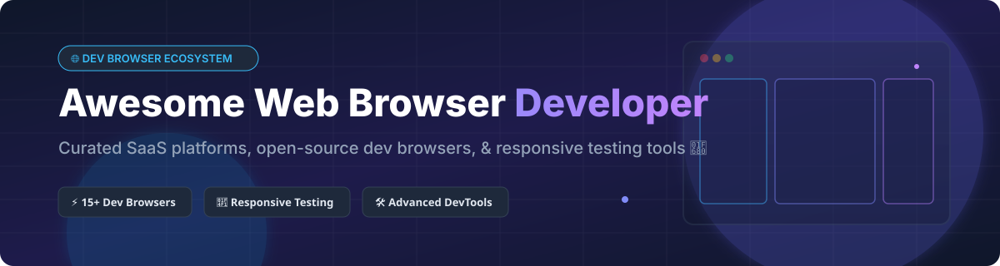

  

# 🌐 Awesome Web Browser Developer 🚀

## 📌 Top Web Browser (Developer) Ecosystem & Tools

> **A curated directory of SaaS platforms, open-source developer browsers, cross-browser testing tools, DevTools extensions, and responsive design preview workflows.**

---

### 💡 What are Developer Browsers?

**Developer Browsers** and preview channels provide specialized capabilities beyond consumer browsers—including multi-viewport synchronized testing, custom inspect options, experimental DevTools features, CSS Grid/Flexbox inspectors, accessibility auditing, and standalone WebKit/Gecko/Chromium runtime preview environments.

*Last updated: October 2026*

---

## 🗂️ Table of Contents

- [📊 Sector Market Overview](#-sector-market-overview)
- [💼 SaaS & Hosted Developer Browser Platforms](#-saas--hosted-developer-browser-platforms)
- [🔓 Open-Source GitHub Projects](#-open-source-github-projects)
- [🛠️ Automation & Developer Tools Protocols](#️-automation--developer-tools-protocols)
- [💖 Support & Community](#-support--community)
- [🤝 How to Contribute](#-how-to-contribute)
- [⚠️ Disclaimer](#️-disclaimer)
- [⭐ Star History](#-star-history)

---

## 📊 Sector Market Overview

> **Market Size & Structure:** The global browser testing and web developer tooling market is estimated at **$3.5B+ (2026)** and is **highly concentrated (winner-take-all dynamics)** around tech giants (Microsoft, Google, Apple) for core browser engines and preview channels, with specialized niche sub-sectors (responsive design & multi-viewport testing) showing moderate fragmentation among commercial indie SaaS tools and open-source alternatives.

---

## 💼 SaaS & Hosted Developer Browser Platforms

The table below lists key commercial developer browsers and official preview channels, sorted by **estimated company size (valuation / annual revenue)** in descending order.

| Platform | Company Size (Rev / Valuation) 📈 | Pricing 💰 | Free Tier / Trial Limit 🎁 | Key Features & Focus 🛠️ |
| :--- | :--- | :--- | :--- | :--- |
| **[Microsoft Edge Dev](https://www.microsoftedgeinsider.com/)** 🟦 | **~$245B+ Rev** (Microsoft Corp) | **$0.00 / month** (Free) | **Unlimited Free Plan** (No caps, full access) | Weekly preview channel with experimental Edge DevTools features before stable release. |
| **[Google Chrome Canary](https://www.google.com/chrome/canary/)** 🟡 | **~$307B+ Rev** (Alphabet Inc) | **$0.00 / month** (Free) | **Unlimited Free Plan** (No caps, daily raw builds) | Daily bleeding-edge build of Chrome with early access to Chrome DevTools & web platform APIs. |
| **[Safari Technology Preview](https://developer.apple.com/safari/technology-preview/)** 🍎 | **~$383B+ Rev** (Apple Inc) | **$0.00 / month** (Free) | **Unlimited Free Plan** (Requires macOS) | Standalone Safari build to preview upcoming WebKit features and Safari Inspect tools. |
| **[Brave Nightly](https://brave.com/download-nightly/)** 🦁 | **~$100M+ Rev** / **~$500M Val** | **$0.00 / month** (Free) | **Unlimited Free Plan** (Daily experimental builds) | Cutting-edge channel of Brave Browser for testing privacy features & custom shields DevTools. |
| **[Opera Developer](https://www.opera.com/developer)** 🔴 | **~$400M+ Rev** (Opera Limited) | **$0.00 / month** (Free) | **Unlimited Free Plan** (Developer preview build) | Opera preview channel with experimental desktop UI and integrated sidebar developer features. |
| **[Vivaldi Snapshot](https://vivaldi.com/blog/snapshots/)** 🎨 | **~$15M+ Rev** (Vivaldi Technologies) | **$0.00 / month** (Free) | **Unlimited Free Plan** (Side-by-side install) | Pre-release builds of Vivaldi with customizable web panels and advanced DevTools integration. |
| **[Polypane](https://polypane.app/)** 📐 | **~$1M–$5M Bootstrapped** | **$9.00 / month** ($108/yr or $11/mo solo) | **14-Day Free Trial** (Full access, no credit card required) | Commercial browser built specifically for responsive web design, multi-viewport sync & accessibility. |

---

## 🔓 Open-Source GitHub Projects

Below is a curated list of top open-source developer browsers, independent engines, and tools, sorted by **GitHub Stars_Count** (descending).

| Project / Repository 📦 | Stars_Count ⭐ | License 📜 | Description & Highlights ⚡ |
| :--- | :--- | :--- | :--- |
| **[Chromium](https://chromium.googlesource.com/chromium/src.git)** 🌐 |  | BSD-3-Clause | The open-source browser foundation powering Chrome, Edge, Brave, and Vivaldi. Direct source for Chrome DevTools. |
| **[Responsively App](https://github.com/responsively-org/responsively-app)** 📱 |  | AGPL-3.0 | **#1 Open-source responsive browser** with 23k+ stars. Features synchronized scrolling, device presets, and quick screenshot tools. |
| **[Ladybird](https://github.com/LadybirdBrowser/ladybird)** 🐞 |  | BSD-2-Clause | Truly independent web browser & C++ engine built from scratch with custom Inspector & DevTools implementation. |
| **[ungoogled-chromium](https://github.com/ungoogled-software/ungoogled-chromium)** 🔒 |  | BSD-3-Clause | Privacy-focused Chromium variant with all Google web services, background requests, and telemetry disabled. |
| **[Servo](https://github.com/servo/servo)** 🦀 |  | MPL-2.0 | Independent parallel web engine written in Rust under Linux Foundation Europe, providing lightweight rendering capabilities. |
| **[WebKit](https://github.com/WebKit/WebKit)** 🧩 |  | BSD / LGPL | Open-source rendering engine for Safari and iOS browsers. WebKitGTK/WPE enables testing WebKit on Linux. |
| **[Brave Core](https://github.com/brave/brave-core)** 🦁 |  | MPL-2.0 | Open-source C++ core for Brave Browser, featuring custom privacy protection mechanisms and DevTools extensions. |
| **[Sizzy](https://github.com/kitze/sizzy)** 📐 |  | MIT / Proprietary | Lightweight browser tool designed for fast responsive testing and side-by-side device viewports. |
| **[Firefox Gecko](https://github.com/mozilla/gecko-dev)** 🦊 |  | MPL-2.0 | Codebase powering Firefox & Firefox Developer Edition with CSS Grid, Flexbox, and accessibility inspectors. |
| **[Epiphany (GNOME Web)](https://github.com/GNOME/epiphany)** 🐧 |  | GPL-3.0 | GNOME desktop native browser built on WebKitGTK with built-in developer tools for WebKit inspection on Linux. |
| **[Min Browser](https://github.com/minbrowser/min)** ⚡ |  | Apache-2.0 | Minimalist open-source browser built with Electron and HTML/JS, featuring built-in ad blocking and DevTools support. |
| **[Browser UI (Beaker / Dat)](https://github.com/beakerbrowser/beaker)** 🧪 |  | MIT | Experimental peer-to-peer browser for Web3 and website authoring with integrated site builder tools. |
| **[Blisk](https://github.com/blisk-io/blisk)** 🛠️ |  | Proprietary / OSS | Developer browser dedicated to test execution, device emulation, URL synchronization, and error monitoring. |
| **[Falkon](https://github.com/KDE/falkon)** 🦅 |  | GPL-3.0 | KDE QtWebEngine browser with integrated Chromium DevTools, ideal for lightweight testing on Linux environments. |

---

## 🛠️ Automation & Developer Tools Protocols

- 🌐 **[Chrome DevTools Protocol (CDP)](https://chromedevtools.github.io/devtools-protocol/)**: Standardized JSON-RPC protocol to inspect, debug, and profile Chromium-based browsers. Powers automation frameworks like Puppeteer and Playwright.
- 🦊 **[Firefox Remote Protocol / WebDriver BiDi](https://firefox-source-docs.mozilla.org/remote/)**: Next-generation bidirectional browser automation standard supported by Mozilla Firefox and Chrome.
- 📱 **[Responsively App Core](https://github.com/responsively-org/responsively-app)**: Open-source responsive multi-viewport testing suite.

---

## 💖 Support & Community

Thank you for visiting and supporting this project! If you find this developer browser resource list helpful, please consider:
- 🌟 **Starring** the repository on GitHub to help others discover it.
- 🍴 **Forking** it to keep a copy or contribute your own entries.
- 📢 **Sharing** it with fellow frontend engineers, QA testers, and developers.
- ☕ **Buying a coffee / Sponsoring**: Support ongoing maintenance via the [GitHub Sponsors Dashboard](https://github.com/sponsors/ishandutta2007).

---

## 🤝 How to Contribute

1. 🍴 **Fork** this repository.
2. 📝 **Add/edit** entries in `README.md` following the formatted table layout.
3. ⚡ Ensure descriptions are concise, factual, and include relevant links & Stars_Badges.
4. 🚀 **Submit a Pull Request** with a clear explanation of your additions!

---

## ⚠️ Disclaimer

- This repository is a **community-curated list** for educational and development workflow reference.
- **Developer preview channels** (Canary, Dev, Nightly, Snapshot) may contain unreleased or unstable code. Do not use preview builds as your primary browser for critical financial or security operations.
- All product names, logos, and trademarks belong to their respective owners.

---

## 📈 Star History

---

  <b>Made with ❤️ for Web Developers, Frontend Engineers, &amp; Browser Tooling Enthusiasts.</b>

